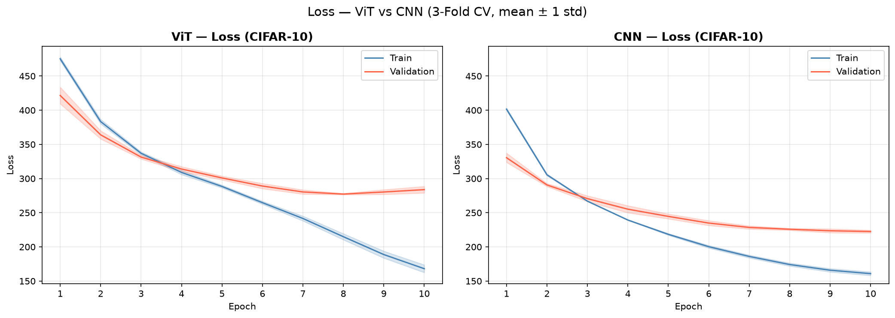
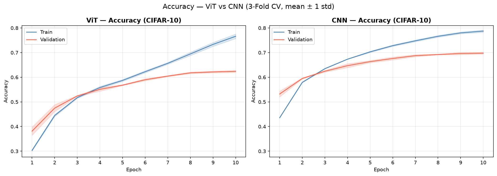
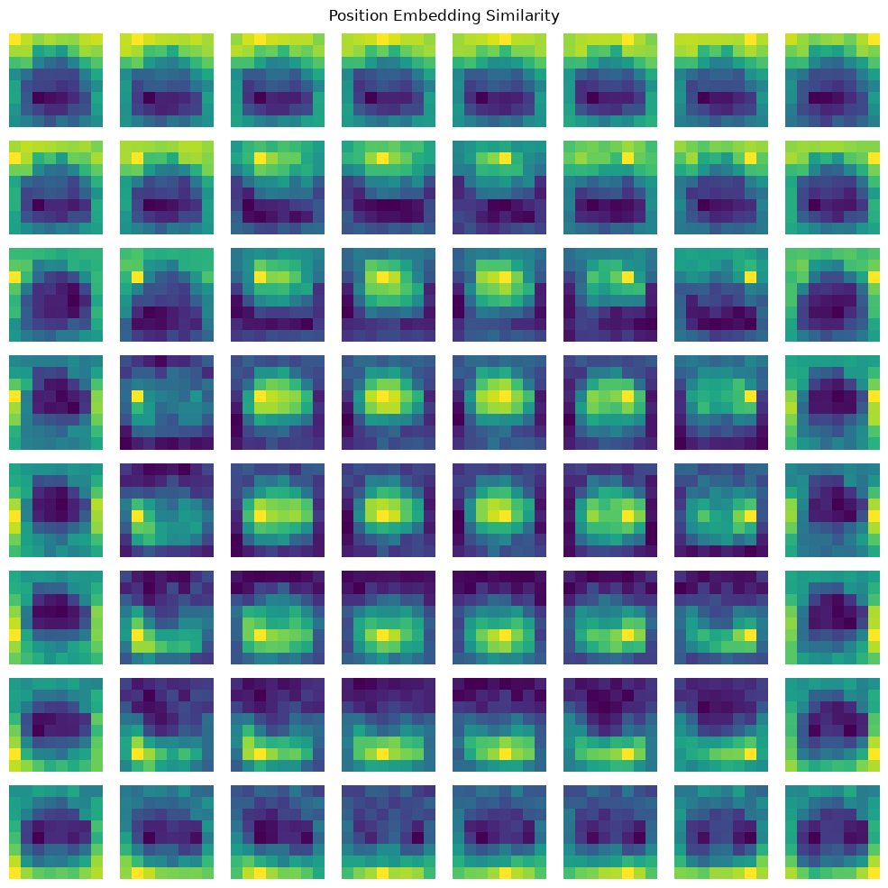

# Results

## Training Curves

### Loss


### Accuracy


## Embedding Visualisation



## CIFAR-10: ViT vs CNN

| Metric     | ViT             | CNN             |
|------------|-----------------|-----------------|
| train_acc  | 0.7662 ± 0.0094 | 0.7872 ± 0.0047 |
| val_acc    | 0.6239 ± 0.0042 | 0.6977 ± 0.0038 |
| test_acc   | 0.6244          | 0.7014          |
| params     | 3,981,322       | 545,098         |
| train time | ~1.5 hr         | ~15 min         |

## Hyperparameters

**ViT**
```
img_size    = 32   (CIFAR-10 height)
patch_size  = 4
in_channels = 3
num_classes = 10
embed_dim   = 256
depth       = 5
num_heads   = 8
mlp_ratio   = 4
```

**CNN**
```
in_channels        = 3
num_classes        = 10
hidden_dim         = 128
kernel_size        = 3
stride             = 1
padding            = 1
conv1_out_channels = 32
conv2_out_channels = 64
```

## Notes

- **Hardware:** Apple M5 MacBook Air, MPS backend (PyTorch)
- **Dataset:** CIFAR-10
- **CNN wins on test accuracy** (+7.7pp) despite 7.3x fewer parameters and 6x faster training.
- **ViT overfits:** train/val gap is 14.2pp vs CNN's 8.6pp. Training loss keeps falling past epoch 10 but validation plateaus — classic inductive-bias gap on small data.
- **Why CNN generalises better here:** CNNs have built-in translation equivariance and local connectivity (inductive bias). ViT has no such priors — it must learn spatial relationships from scratch, which requires more data than CIFAR-10 provides at this scale.
- **ViT validation variance:** ViT shows slightly higher variance in validation accuracy than CNN, especially early in training. Likely because without positional priors, the model initially has no sense of where patches are spatially — it takes several epochs before position embeddings stabilise enough to guide consistent predictions.
- **Position embeddings capture locality but skew to edges:** the learned embeddings do encode relative patch proximity, but patches at the edges show disproportionate attention toward the opposite edge rather than their immediate neighbours. This suggests the model compensates for the lack of convolutional locality by learning long-range edge-to-edge correlations as a spatial anchor — an artefact of learning position from scratch on small images.
- **Known deviations from paper:** original ViT (Dosovitskiy et al. 2020) trained on JFT-300M / ImageNet-21k; this reproduction trains from scratch on CIFAR-10 — a fundamentally harder regime for ViT.
